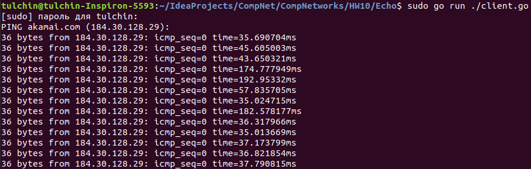
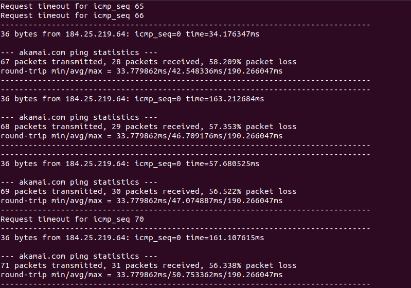
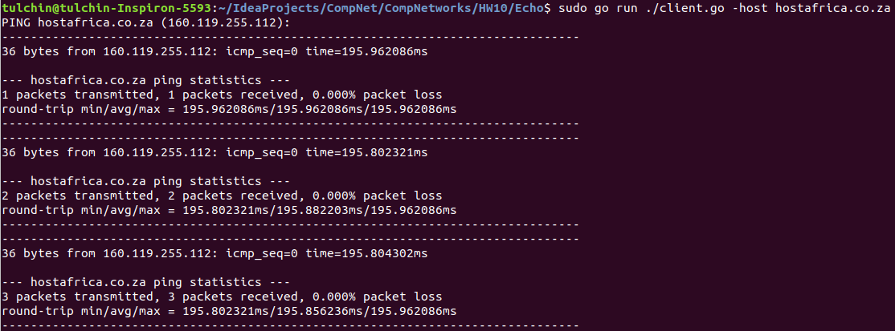

## Программирование.

### Эхо запросы через ICMP

Приложение написано на языке Go.

Для его запуска нужно из корня проекта вызвать

```angular2html
go run ./client.go <args>
```
Аргументы:
1) ```-host``` -- хост, на который мы хотим отправлять запросы (по умолчанию ```akamai.com```).

***ВАЖНО:*** для меня требовался запуск приложения в привелигерованном режиме (```sudo```).

### Работа кода для части А

Если взять хост ```akamai.com```:



### Работа кода для части Б и В

Если взять хост ```akamai.com``` (и сделать искуственную потерю пакетов):



Если взять хост ```hostafrica.co.za```:

