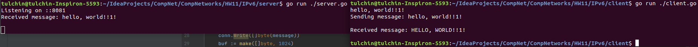

## Программирование

### Использование протокола IPv6

Для реализации серверной и клиентской частей я пользовался языком Go.

Для запуска сервера нужно из корня проекта вызвать:

```angular2html
go run ./server/server.go <args>
```
Аргументы:
1) ```-port``` -- порт, в формате ```:dddd``` (по умолчанию ```:8081```).

Сервер запустится на localhost-е.

Для запуска клиента нужно из корня проекта вызвать:

```angular2html
go run ./client/client.go <args>
```
Аргументы:
1) ```-port``` -- порт, в формате ```:dddd``` (по умолчанию ```:8081```).

Клиент подключится к localhost-у.

Версия IPv6 предоставляется аргументом ```tcp6``` при обращении к ```net.Listen```.

