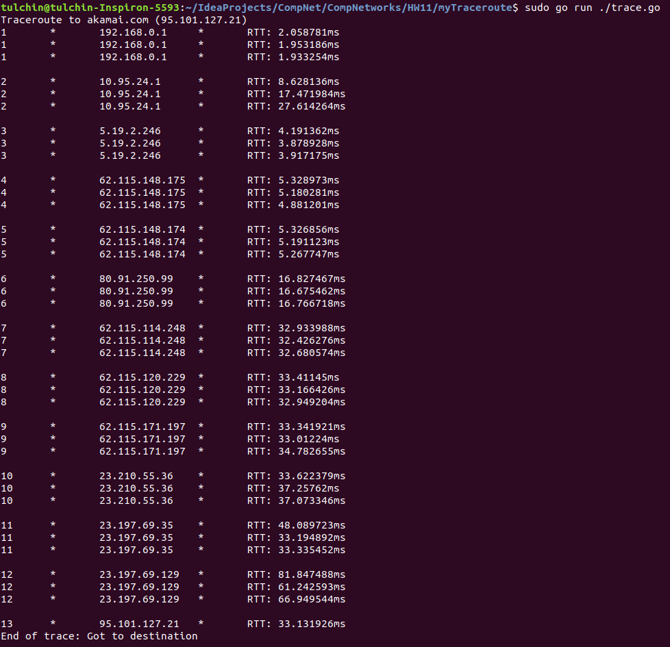
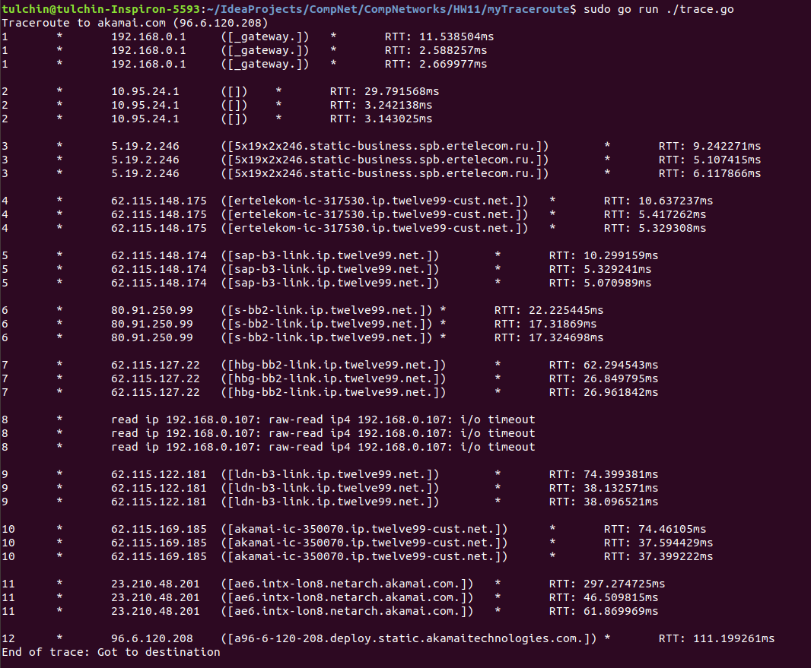

## Программирование

### Трассировка маршрута с использованием ICMP

Приложение написано на языке Go (без использования готовых пакетов для работы с icmp).

Для его запуска нужно из корня проекта вызвать

```angular2html
go run ./trace.go <args>
```
Аргументы:
1) ```dst``` -- имя хоста, до которого мы хотим запустить трассировку (по умолчанию ```akamai.com```).
2) ```ret``` -- количество отправок с одним TTL (по умолчанию 3).
3) ```time``` -- таймаут на ожидание ответа от узлов в секундах (по умолчанию 1).
4) ```ip``` -- локальный IP для отправки сообщений. По умолчанию программа может его вычислить (если вдруг это не получилось, нужно будет передать его по данному флагу).

***ВАЖНО:*** для меня требовался запуск приложения в привелигерованном режиме (```sudo```).

### Работа кода для части А



### Работа кода для части Б


