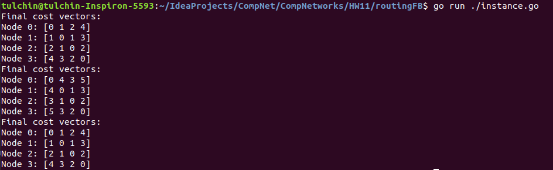
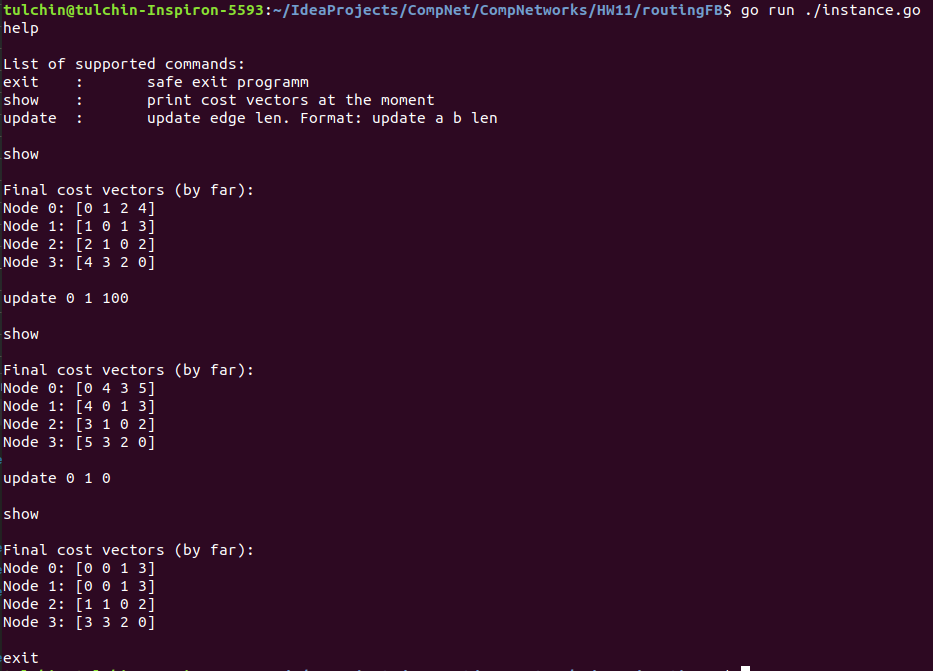

## Программирование

### Дистанционно-векторная маршрутизация

Приложение написано на языке Go.

Для его запуска нужно из корня проекта вызвать

```angular2html
go run ./instance.go
```

После этого идет общение пользователя с приложением. В консоль можно вводить команды, 
приложение будет на них отвечать. Список доступных команд:
1) ```help``` (или любая несуществующая команда) -- вывод информации о доступных командах и примеров пользования.
2) ```exit``` -- завершение работы приложения.
3) ```show``` -- вывод текущего состояния стоимостей. ***Важно:*** начальное обновление стоимостей
произойдет через секунду после начала работы.
4) ```update a b len``` -- обновить двунаправленное ребро между вершинами ```a``` и ```b```, заменить его стоимость на ```len```.
```len``` может быть как меньше, так и больше предыдущей стоимости.

### Работа кода для части А и В

Для распараллеливания я воспользовался горутинами. Синхронизация -- каналы (```channels```).



### Работа кода для части Б

