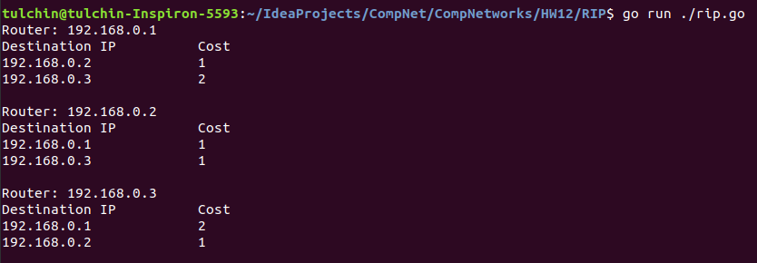
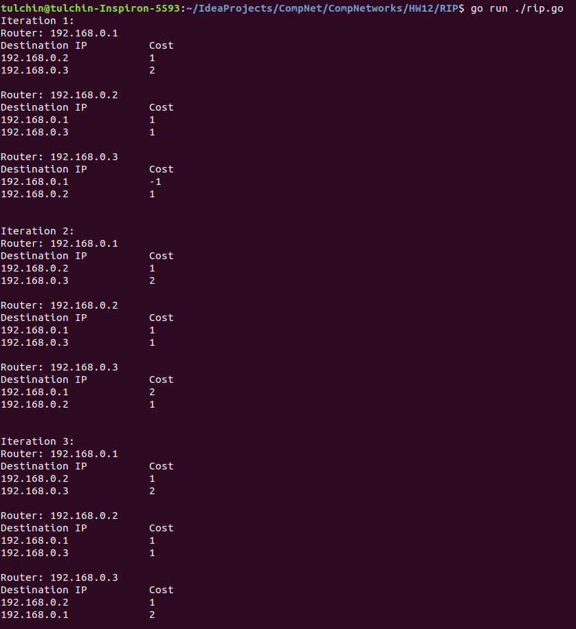
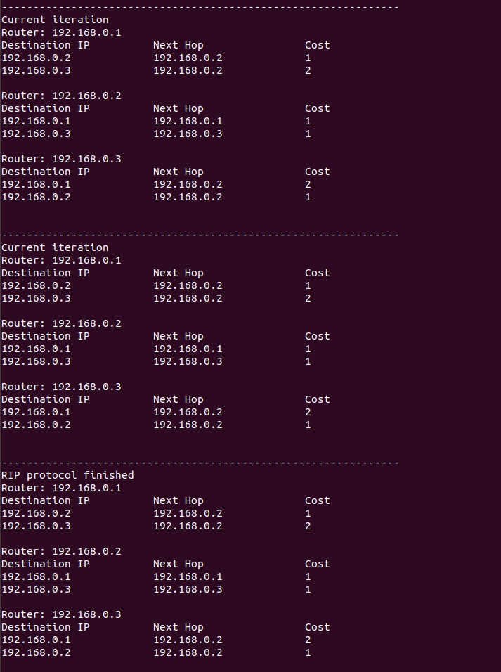
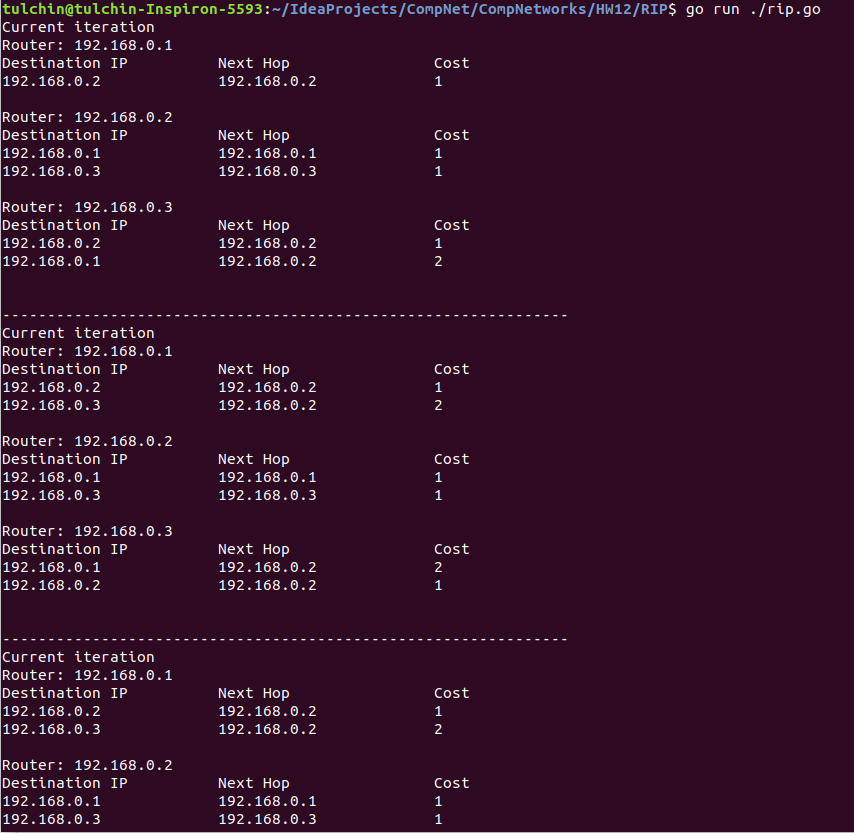

## Программирование

### RIP

Приложение написано на языке Go.

Для его запуска нужно из корня проекта вызвать

```angular2html
go run ./rip.go
```

Топология сети задается в [json-конфиге](as.json).

### Работа кода для части А

Вывод ```Next Hop``` был добавлен позднее.



### Работа кода для части Б

Вывод ```Next Hop``` был добавлен позднее.



После добавления ```Next Hop```:



### Работа кода для части В

Для распараллеливания я воспользовался горутинами. Синхронизация между ними -- ```sync.WaitGroup``` и ```sync.Map```.

