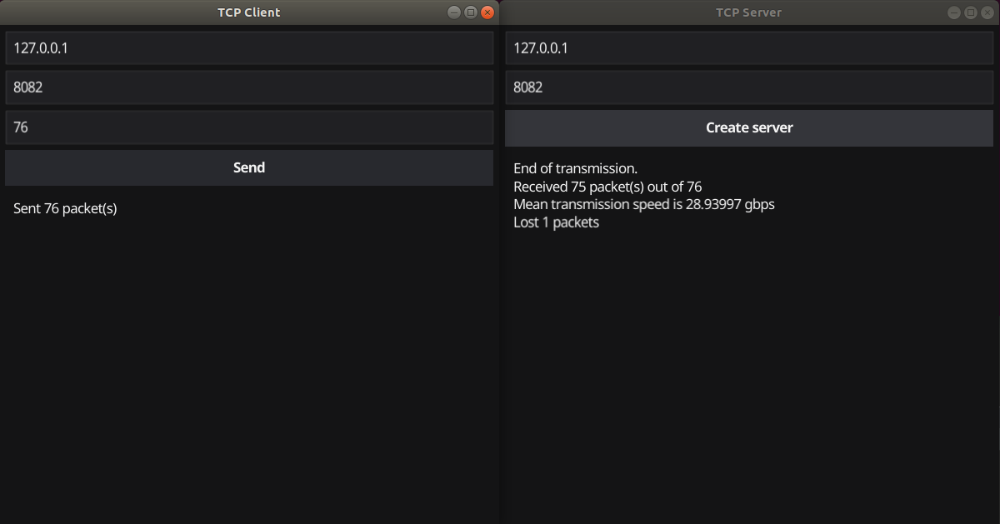
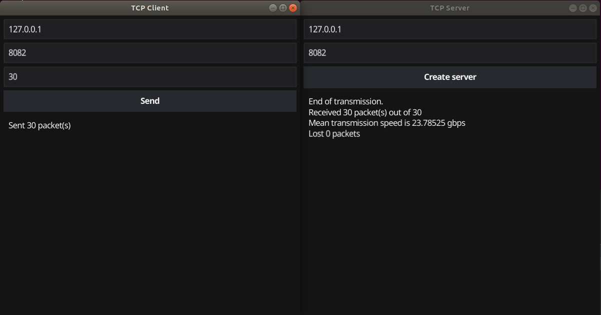
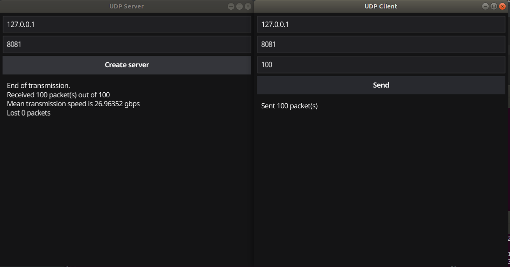

## Программирование

### Скорость передачи

Серверы и клиенты написаны на языке Go.

### TCP

Для запуска TCP сервера нужно из корня проекта вызвать

```angular2html
go run ./TCP/server/server.go
```

Для запуска TCP клиента нужно из корня проекта вызвать

```angular2html
go run ./TCP/client/client.go
```

### Работа GUI





### UDP

Для запуска UDP сервера нужно из корня проекта вызвать

```angular2html
go run ./UDP/server/server.go
```

Для запуска UDP клиента нужно из корня проекта вызвать

```angular2html
go run ./UDP/client/client.go
```

### Работа GUI

