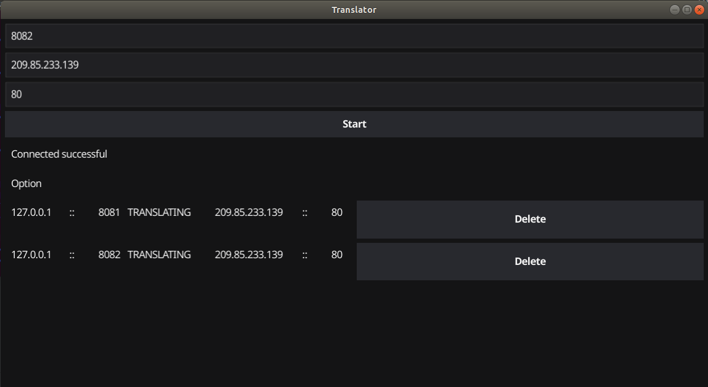
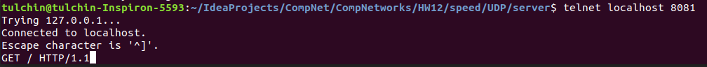

## Программирование

### Транслятор портов

Сервер написан на языке Go.

Для его запуска нужно из корня проекта вызвать

```angular2html
go run ./server.go
```

### Работа GUI и пример использования



