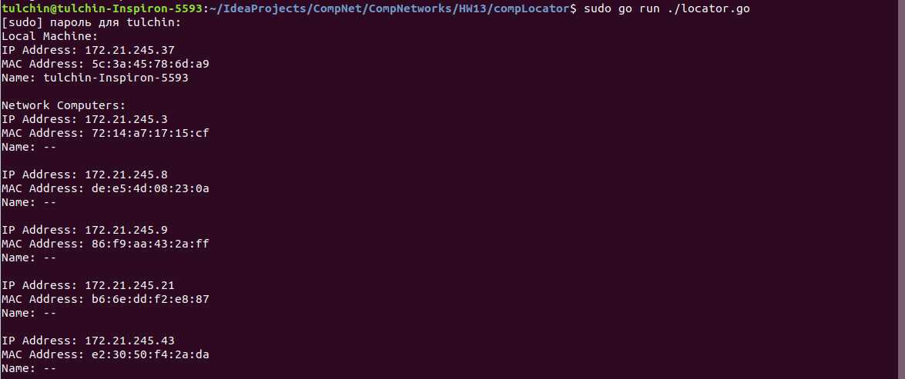
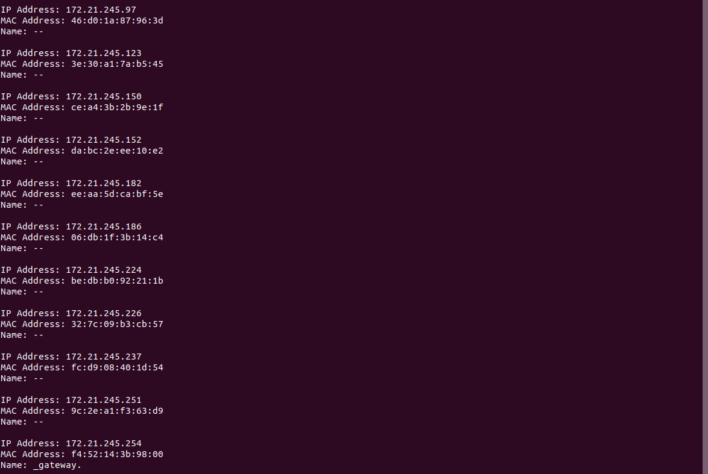
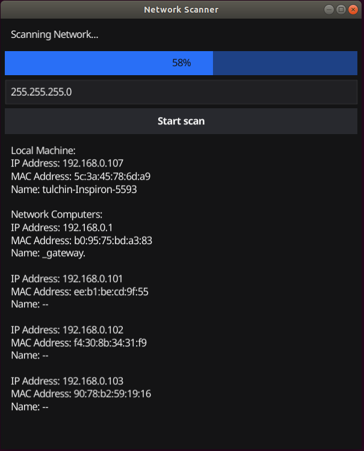

## Программирование

### Определение всех компьютеров в сети

Приложение написано на языке Go.

Для его запуска нужно из корня проекта вызвать

```angular2html
sudo go run ./locator.go
```

***ВАЖНО:*** для меня требовался запуск приложения в привелигерованном режиме (```sudo```).

Для получения MAC-адреса девайса в сети, на данный IP-адрес посылается ICMP-Echo-запрос 
и ожидается ответ. Если ответа нет определенное время, то считается, что на данном IP-адресе нет девайса. Иначе 
в ответе будет содержаться MAC-адрес внутри Ethernet слоя. Для анализа информации о пакетах (с разделением на слои) 
я использовал ```github.com/google/gopacket```.

### Работа кода для части А





### Работа кода для части Б

