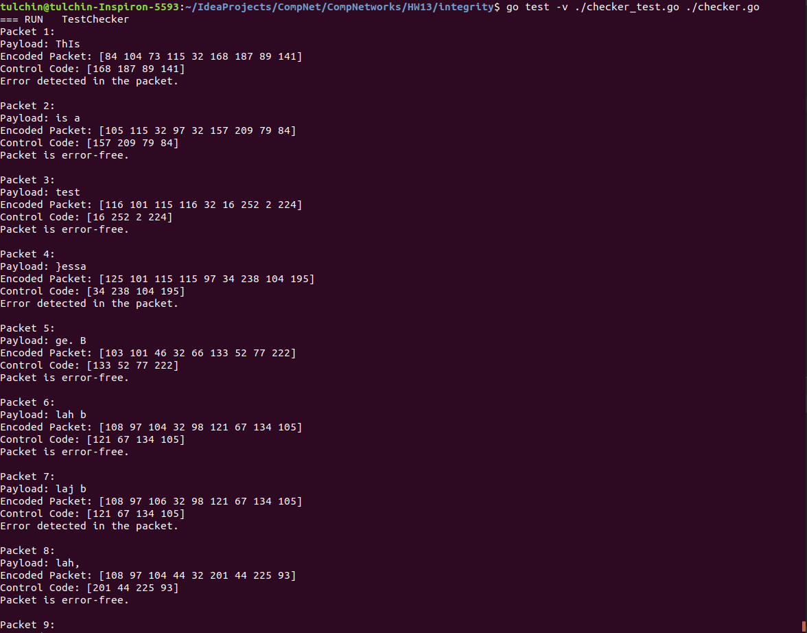

## Программирование

### Проверка целостности пакетов

Приложение написано на языке Go. Для получения CRC кодов используется пакет ```hash/crc32```.`

Функции и пример использования заданы в файле [```./checker.go```](checker.go).
Тесты находятся в файле [```./checker_test.go```](checker_test.go).

Для запуска тестов надо из корня проекта вызвать
```angular2html
go test -v ./checker_test.go ./checker.go
```

