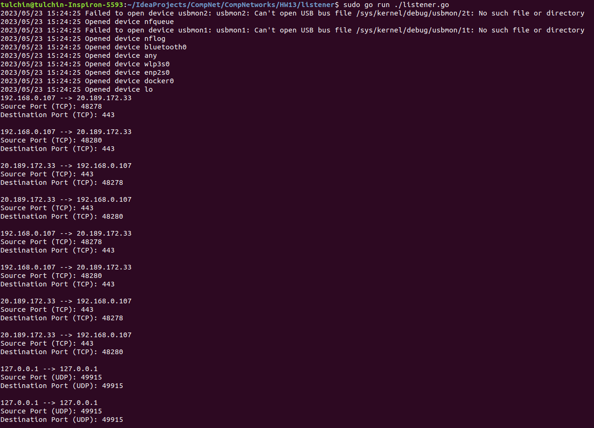

## Программирование

### Подсчет сетевого трафика

Приложение написано на языке Go.

Для его запуска нужно из корня проекта вызвать

```angular2html
sudo go run ./listener.go
```

***ВАЖНО:*** для меня требовался запуск приложения в привелигерованном режиме (```sudo```).

Для прослушки трафика я пользовался пакетом ```github.com/google/gopacket```.

### Работа кода для части А

Учет IP-адреса, для которого нужно выводить статистику, появился позднее.


### Работа кода для части Б



### Работа кода для части В


Поле для IP-адреса необходимо для заполнения, если нужно собрать статистику. 
Если нужно собрать статистику по определенному порту данного адреса, нужно также заполнить поле для порта.

Если нужно собрать статистику по IP-адресу необходимо нажать на кнопку прослушивания всего трафика.
Если нужно собрать статистику по порту данного IP-адреса необходимо нажать на кнопку прослушивания трафика по порту.

Чтобы остановить прослушку и получить статистику (будет в конце лога), надо нажать на кнопку остановки прослушки.
В лог выводится вся информация о всех захваченных пакетах.

Также можно указать какой девайс надо прослушивать (по умолчанию все интерфейсы на данном устройстве).
Например, можно выбрать ```wlp3s0```, ```bluetooth0```, ```enp2s0``` и тд.