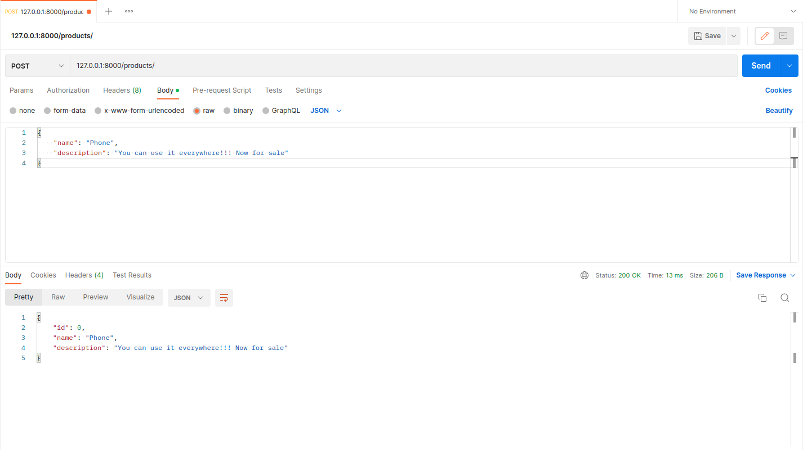

##  Программирование. Rest Service

### Задание А

Для реализации Rest сервиса я пользовался пакетом [fastapi](https://fastapi.tiangolo.com/) для python. 
На сайте написано что нужно для корректной работы, но я продублирую информацию и здесь: 
```angular2html
pip install fastapi
pip install "uvicorn[standard]"
```
Для начала работы, нужно из корня проекта запустить:
```angular2html
uvicorn main:app --reload
```

### Задание Б

#### Команда POST

Создаю два продукта
  
  

#### Команда PUT


#### Команда GET

  
 

#### Команда GET всех продуктов


#### Команда DELETE


### Задание В

Иконки будут храниться в двоичном представлении.

Есть два способа реализовать загрузку (и изменения) продуктов.
К сожалению, оба себе противоречат:

#### Загружать и иконку и данные через form-data

Если выбрать этот случай, то не нужно писать новых адресов, только изменить имеющиекся. 
Но проблема возникает в том, что в form-data нельзя указывать Body, так оно будет кодироваться (и не будет корректно приниматься):
```angular2html
You can declare multiple File and Form parameters in a path operation, 
but you can't also declare Body fields that you expect to receive as JSON, 
as the request will have the body encoded using multipart/form-data instead of 
application/json. 
This is not a limitation of FastAPI, it's part of the HTTP protocol.
```
Можно принимать Form данные, но тогда нельзя будет отсылать raw данные (все POST и PUT надо будет проводить через form-data).

#### Написать отдельную ручку загрузки иконки

Загружать и обновлять иконку отдельно от продукта.

В качестве рабочего был выбран второй вариант (но в коде есть и закоменченный первый)

#### Скриншоты первого варианта


#### Скриншоты второго варианта


