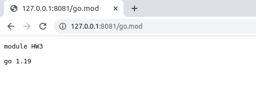
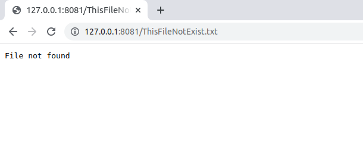
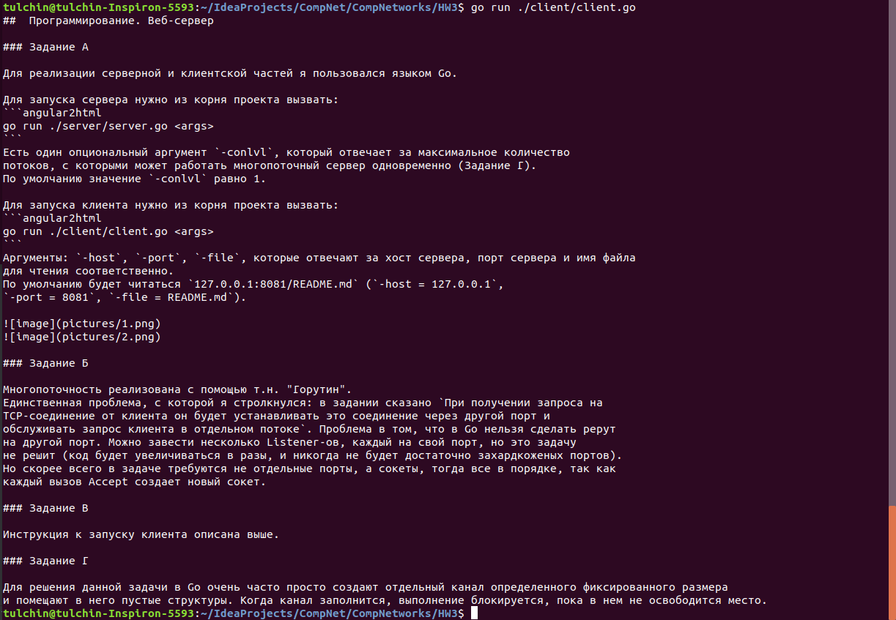

##  Программирование. Веб-сервер

### Задание А

Для реализации серверной и клиентской частей я пользовался языком Go.

Для запуска сервера нужно из корня проекта вызвать:
```angular2html
go run ./server/server.go <args>
```
Есть один опциональный аргумент `-conlvl`, который отвечает за максимальное количество
потоков, с которыми может работать многопоточный сервер одновременно (Задание Г). 
По умолчанию значение `-conlvl` равно 1.

Для запуска клиента нужно из корня проекта вызвать:
```angular2html
go run ./client/client.go <args>
```
Аргументы: `-host`, `-port`, `-file`, которые отвечают за хост сервера, порт сервера и имя файла 
для чтения соответственно.
По умолчанию будет читаться `127.0.0.1:8081/README.md` (`-host = 127.0.0.1`,
`-port = 8081`, `-file = README.md`).


  

### Задание Б

Многопоточность реализована с помощью т.н. "Горутин". 
Единственная проблема, с которой я стролкнулся: в задании сказано `При получении запроса на
TCP-соединение от клиента он будет устанавливать это соединение через другой порт и
обслуживать запрос клиента в отдельном потоке`. Проблема в том, что в Go нельзя сделать рерут 
на другой порт. Можно завести несколько Listener-ов, каждый на свой порт, но это задачу 
не решит (код будет увеличиваться в разы, и никогда не будет достаточно захардкоженых портов). 
Но скорее всего в задаче требуются не отдельные порты, а сокеты, тогда все в порядке, так как 
каждый вызов Accept создает новый сокет.

### Задание В

Инструкция к запуску клиента описана выше.

  

### Задание Г

Для решения данной задачи в Go очень часто просто создают отдельный канал определенного фиксированного размера 
и помещают в него пустые структуры. Когда канал заполнится, выполнение блокируется, пока в нем не освободится место.
