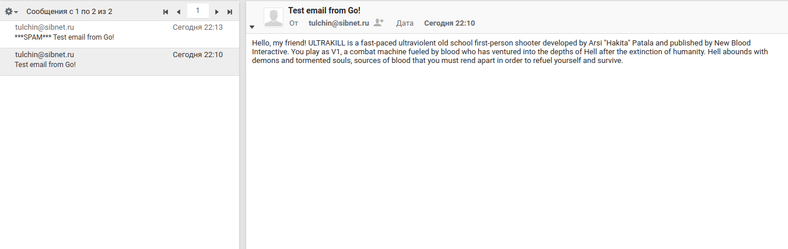
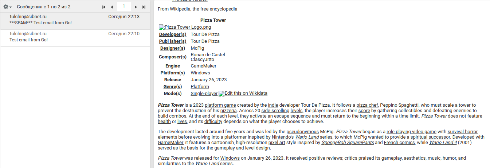

## Программирование сокетов

### Почта и SMTP. 1

Для отправки сообщений воспользуемся пакетом ```net/smtp``` языка Go.

Для запуска отправщика нужно из корня проекта вызвать:
```angular2html
go run ./emailSender.go <args>
```
Аргументы:
1) ```-addrFrom``` -- Email адрес отправителя (обязательно).
2) ```-pwrd``` -- пароль для предыдущего адреса (обязательно).
3) ```-addrTo``` -- Email адрес получателя (обязательно).
4) ```-host``` -- smtp хост (по умолчанию ```mail.sibnet.ru```).
5) ```-port``` -- smtp порт (по умолчанию ```25```).
6) ```-fp``` -- путь до файла, который нужно отправить. 
Файл может быть в формате ```.txt``` или ```.html``` (по умолчанию ```hello.txt```).


  