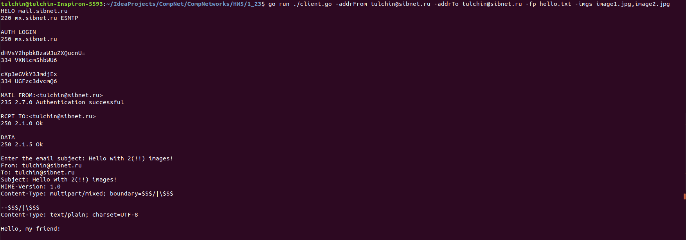

## Программирование сокетов

### Почта и SMTP. 2 + 3

Почтовый клиент реализован на языке Go.

Для запуска клиента нужно из корня проекта вызвать:
```angular2html
go run ./client.go <args>
```
Аргументы:
1) ```-addrFrom``` -- Email адрес отправителя (обязательно).
2) ```-pwrd``` -- пароль для предыдущего адреса (обязательно).
3) ```-addrTo``` -- Email адрес получателя (обязательно).
4) ```-host``` -- smtp хост (по умолчанию ```mail.sibnet.ru```).
5) ```-port``` -- smtp порт (по умолчанию ```25```).
6) ```-fp``` -- путь до файла с текстом, который нужно отправить
(по умолчанию ```hello.txt```).
7) ```-imgs``` -- пути до файлов с изображениями, разделенными запятой 
(по умолчанию изображений в сообщении нет). Пример значения аргумента для 
отправки двух изображений: ```-imgs image1.jpg,image2.jpg```.



