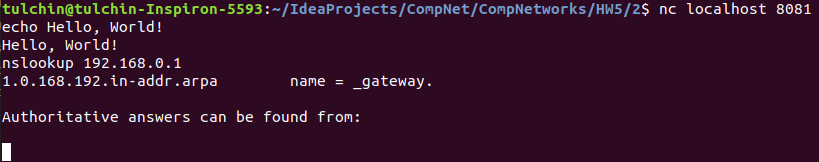

## Программирование сокетов

### Удаленный запуск команд

Сервер реализован на языке Go.

Для запуска сервера нужно из корня проекта вызвать:
```angular2html
go run ./server.go <args>
```
Аргументы:
1) ```-port``` -- порт, в формате ```:dddd``` (по умолчанию ```:8081```).

Сервер запустится на localhost-е.

  