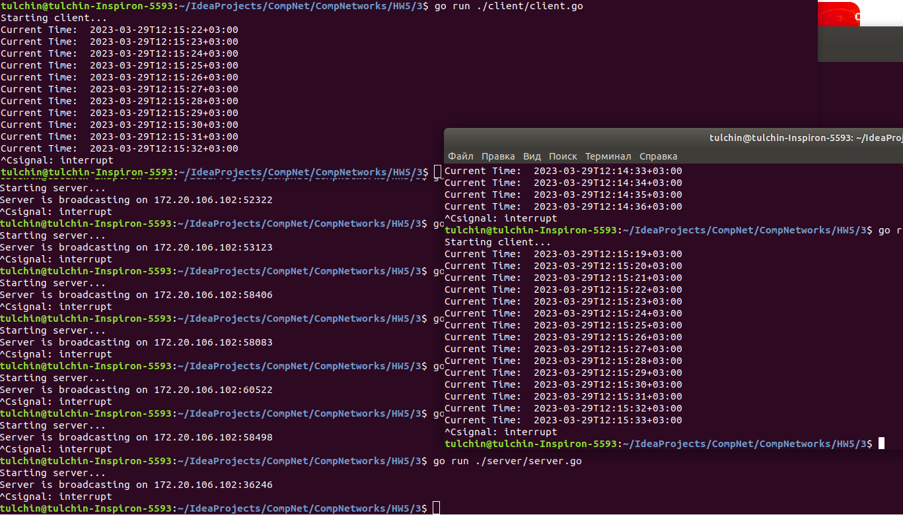

## Программирование сокетов

###  Широковещательная рассылка через UDP

Для реализации серверной и клиентской частей я пользовался языком Go.

Стандартный пакет ```net``` не позволяет нескольким клиентам слушать один порт 
(при попытке завести таких клиентов, заработает только один, а остальные запаникуют 
из-за занятого порта). Для решения данной проблемы клиент вместо пакета ```net``` 
использет пакет [reuseport](https://github.com/libp2p/go-reuseport).

Для запуска сервера нужно из корня проекта вызвать:
```angular2html
go run ./server/server.go <args>
```
Аргументы:
1) ```-port``` -- порт, в формате ```:dddd``` (по умолчанию ```:8081```).

Сервер запустится на localhost-е.

Для запуска клиентов нужно из корня проекта вызвать:
```angular2html
go run ./client/client.go <args>
```
Аргументы:
1) ```-port``` -- порт, в формате ```:dddd``` (по умолчанию ```:8081```).

  