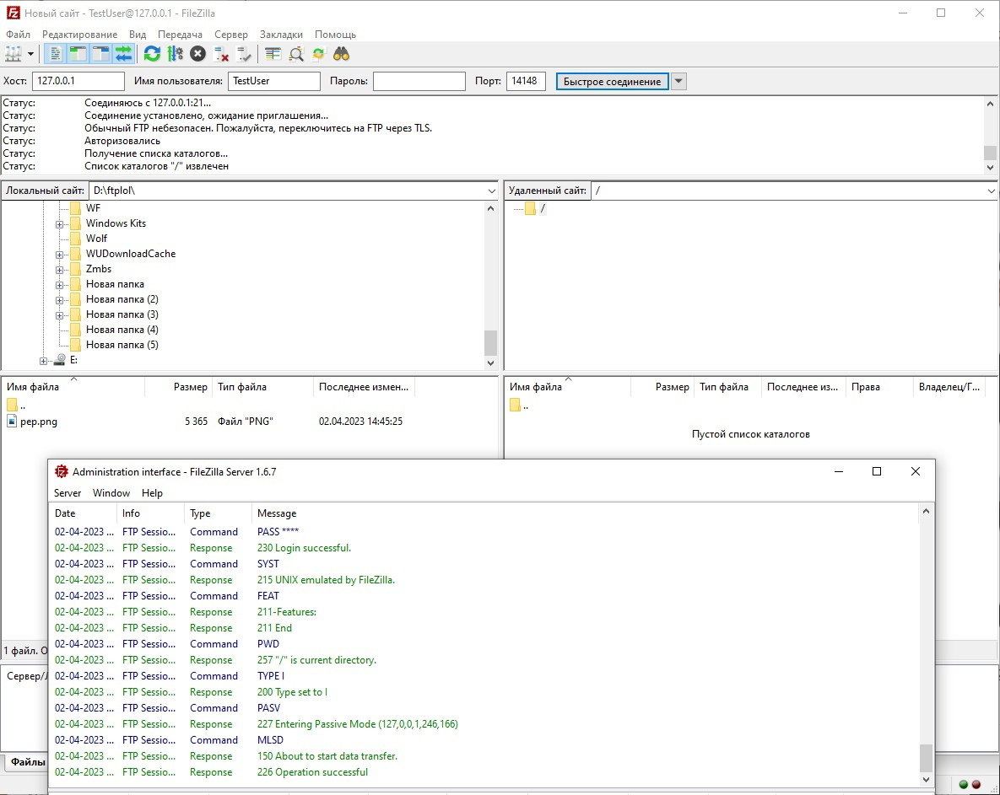
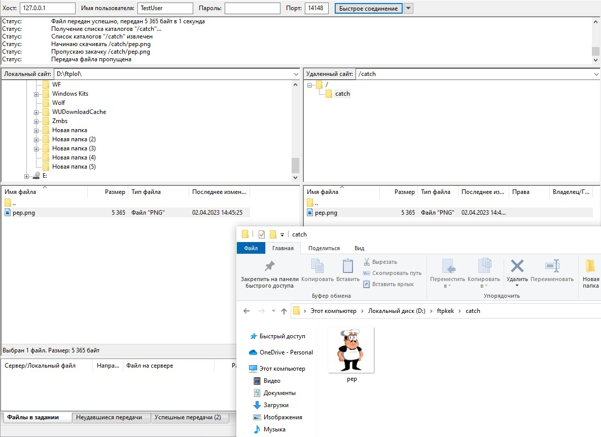
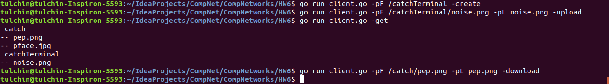
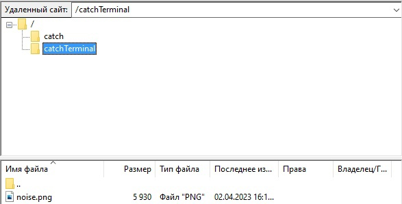

## Программирование. FTP

### Установка FileZilla

Сервер и клиент установил, удалось с клиента подключиться к серверу 
и выполнить несколько простых запросов (создание папки, загрузка и сохранение файла).




И клиент, и сервер были установлены на отдельное устройство с Windows.

### FTP клиент

Базовое консольное приложение было написано на языке Go с использованием 
пакета [jlaffaye/ftp](https://github.com/jlaffaye/ftp).

Для запуска клиента нужно из корня проекта вызвать:
```angular2html
go run client.go <args> <mods>
```
Аргументы:
1) ```-addr``` -- хост сервера (по умолчанию ```192.168.0.105```).
2) ```-user``` -- login клиента для подключения к серверу (по умолчанию ```San```).
3) ```-pwrd``` -- пароль клиента для подключения к серверу (по умолчанию ```123```).
4) ```-pF``` -- путь до файла на сервере. Этот аргумент нужен для 
запуска приложения на скачивание или загрузку файла. По умолчанию ```/catch/pep.png```.
5) ```-pL``` -- относительный путь до локального файла. Этот аргумент нужен для
запуска приложения на скачивание или загрузку файла. По умолчанию ```samples/pep.png```.

Также приложение можно запустить в 4 разных режимах (которые задаются своими флагами):
1) ```-get``` -- запросить все файлы на сервере. Приложение будет рекурсивно обходить 
все директории и выведет на консоль получившееся дерево.
2) ```-create``` -- создать папку на сервере. Путь до создаваемой папки
передается в аргументе ```-pF```.
3) ```-upload``` -- загрузить файл на сервер. **ВАЖНО**: папка хранения 
файла на сервере должна уже существовать. Путь до локального файла (который загружаем)
задается в ```-pL```, путь до места хранения -- в ```-pF```.
4) ```-download``` -- сохранить файл с сервера. Путь до локального места хранения (куда сохраняем)
   задается в ```-pL```, путь до файла на сервере -- в ```-pF```.

Примеры: 




#### Если вы хотите запустить сервер на одном устройстве, а клиент на другом, не забудте отключить Windows фаервол.

### GUI FTP клиент

Его реализация, документация и пример пользования находятся 
[в соответствующей папке](gui).