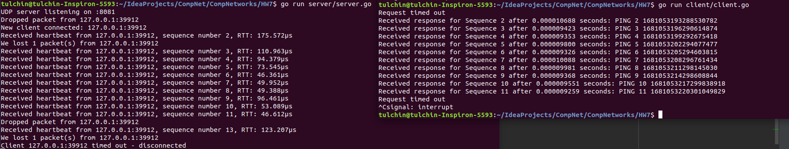

## Программирование. Эхо запросы через UDP

Для реализации серверной и клиентской частей я пользовался языком Go.

Для запуска сервера нужно из корня проекта вызвать:

```angular2html
go run ./server/server.go <args>
```
Аргументы:
1) ```-port``` -- порт, в формате ```:dddd``` (по умолчанию ```:8081```).
2) ```-time``` -- таймаут, промежуток времени, после которого молчащий клиент буде считаться 
отключившимся (для части Г).

Сервер запустится на localhost-е.

Для запуска клиента нужно из корня проекта вызвать:

```angular2html
go run ./client/client.go <args>
```
Аргументы:
1) ```-port``` -- порт, в формате ```:dddd``` (по умолчанию ```:8081```).
2) ```-time``` -- пульс, промежуток времени между отправками сообщений на сервер (для части Г).

Клиент подключится к localhost-у.

Код для частей В и Г дополнял код для части А+Б.

### Работа кода для части А+Б:


### Работа кода для части В:


### Работа кода для части Г:



Если поставить отключение клиента после потери пакета, то снова можно увидеть статистику:

