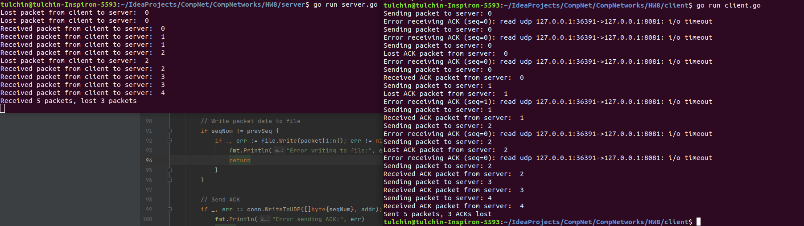
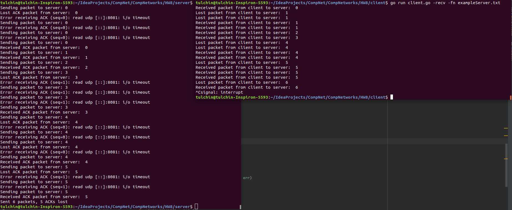

## Программирование. Реализация протокола Stop and Wait

Для реализации серверной и клиентской частей я пользовался языком Go.

Для запуска сервера нужно из корня проекта вызвать:

```angular2html
go run ./server/server.go <args>
```
Аргументы:
1) ```-port``` -- порт, в формате ```:dddd``` (по умолчанию ```:8081```).
2) ```-time``` -- таймаут в секундах, промежуток времени, после которого ACK от клиента считается потеряным (для части Б). 
По умолчанию 2 секунды.

Сервер запустится на localhost-е.

Для запуска клиента нужно из корня проекта вызвать:

```angular2html
go run ./client/client.go <args> <mods>
```
Аргументы:
1) ```-port``` -- порт, в формате ```:dddd``` (по умолчанию ```:8081```).
2) ```-time``` -- таймаут в секундах, промежуток времени, после которого ACK от сервера считается потеряным.
По умолчанию 2 секунды.
3) ```-fn``` -- имя файла для передачи или принятия. По умолчанию ```exampleClient.txt```.

Также для части Б поддерживается принятие файла сервером. Для запуска клиента на принятие 
есть флаг ```-recv```.

Клиент подключится к localhost-у.

### Работа кода для части А:



### Работа кода для части Б:



Примеры файлов: для отправки клиент -> сервер: ```./client/exampleClient.txt```.

Примеры файлов: для отправки сервер -> клиент: ```./server/exampleServer.txt```.

### Код для части В:

Код (функции + тесты) находятся [в отдельной папке](./sum).