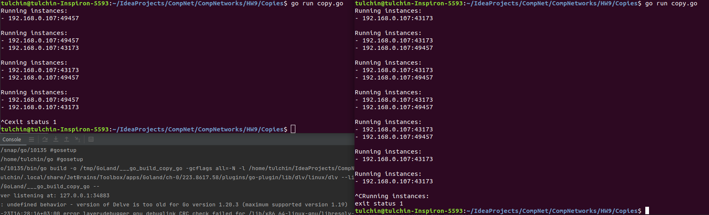

## Программирование.

### Широковещательная рассылка для подсчета копий приложения    

Приложение написано на языке Go.

Для его запуска нужно из корня проекта вызвать
```angular2html
go run ./copy.go
```

