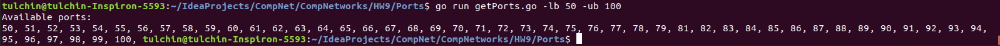

## Программирование.

### Доступные порты

Приложение написано на языке Go.

Для его запуска нужно из корня проекта вызвать
```angular2html
go run ./getProts.go <args>
```
Аргументы:
1) ```-addr``` -- IP-адресс, для которого нужно искать свободные порты (по умолчанию ```127.0.0.1```).
2) ```-lb``` -- нижняя граница поиска свободных портов (по умолчанию ```0```).
3) ```-ub``` -- верхняя граница поиска свободных портов (по умолчанию ```65535```).

